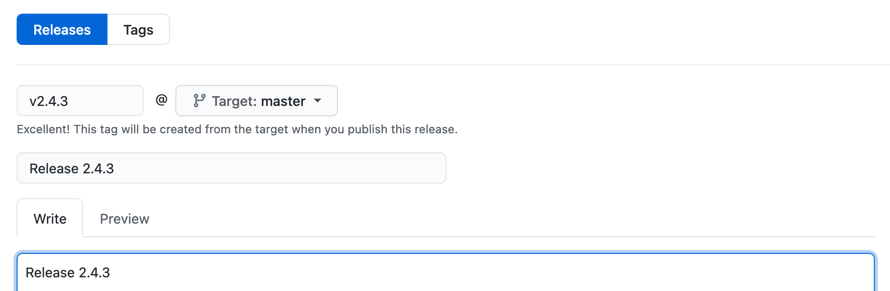

## Semantic Versioning

Ransack attempts to follow semantic versioning in the format of `x.y.z`, where:

`x` stands for a major version (new features that are not backward-compatible).

`y` stands for a minor version (new features that are backward-compatible).

`z` stands for a patch (bug fixes).

In other words: `Major.Minor.Patch`.


## Release Process

*For the maintainers of Ransack.*

To release a new version of Ransack and publish it to RubyGems, take the following steps:

- Create a new release, marked `Prerelease`.
- Update the versions file to the new release, commit and push to `master`.
- Update the [`version.rb`](https://github.com/activerecord-hackery/ransack/lib/ransack/version.rb) file to the new release, commit and push to `master`.
- From the terminal, run the following commands:

```bash
rake build
rake release
```


